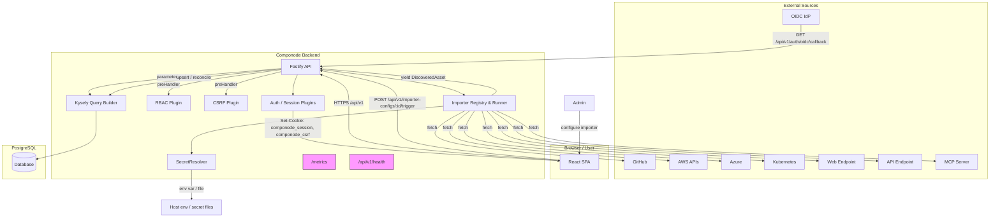
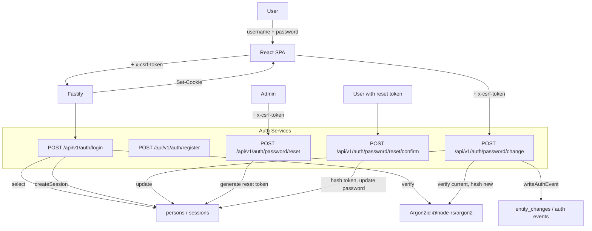
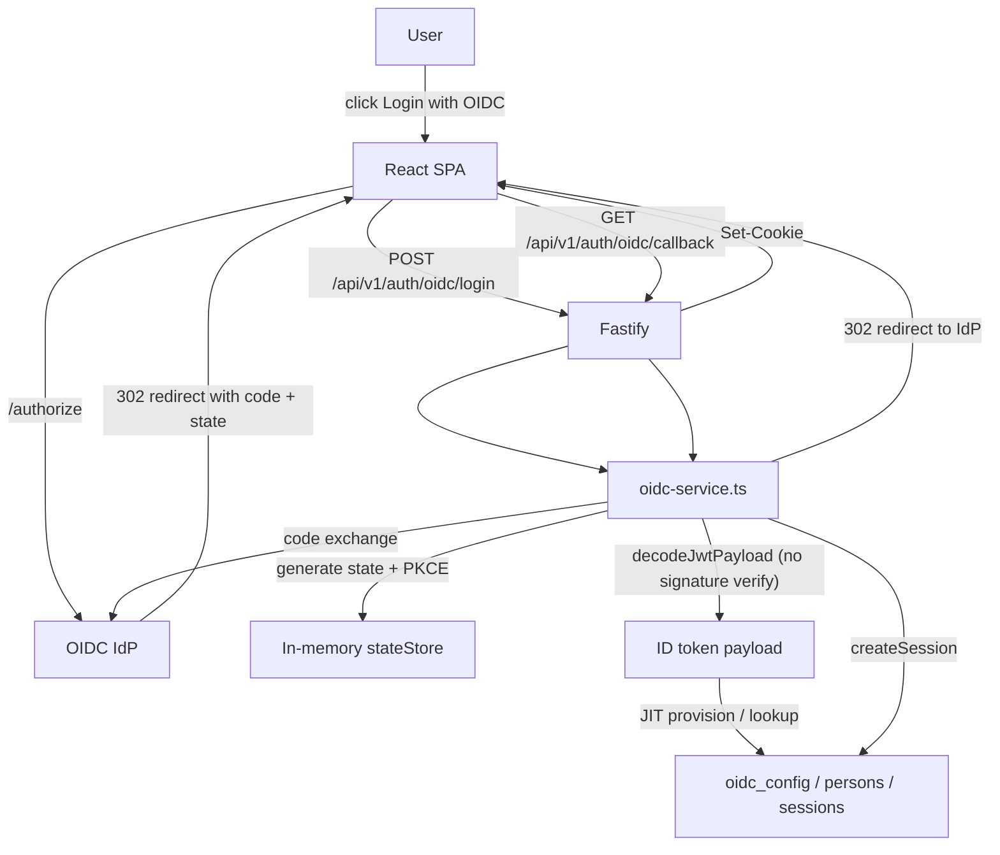
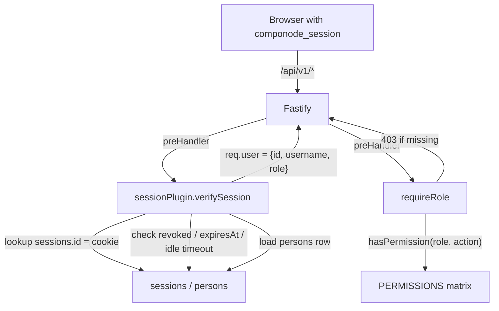
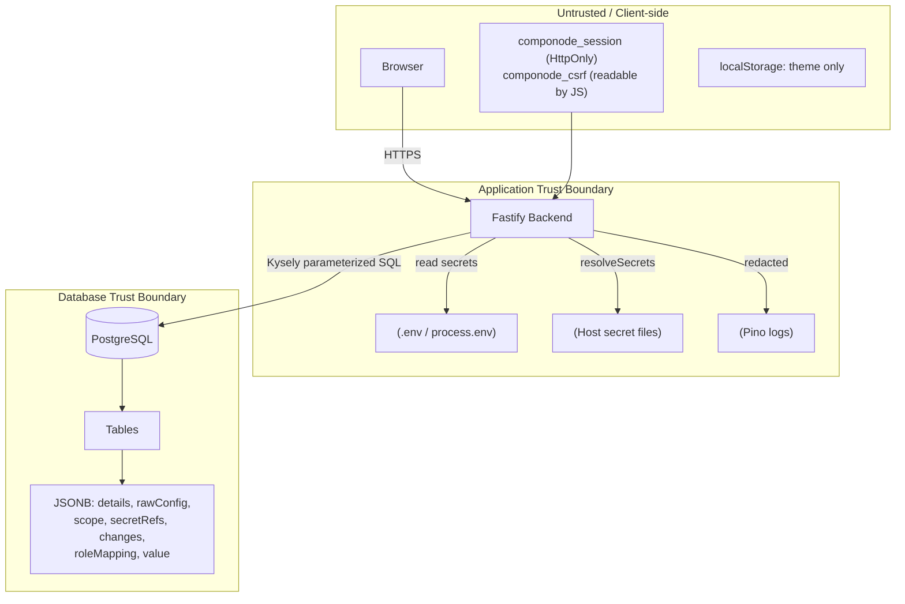
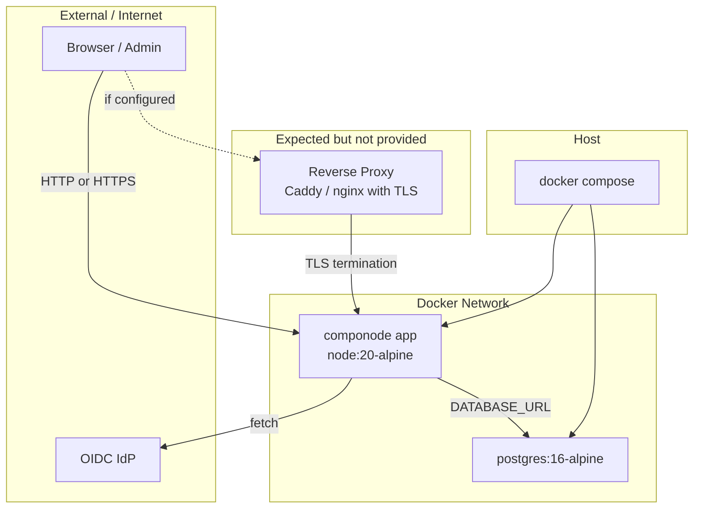

# Componode Security Assessment Report

- **Date:** 2026-09-10
- **Scope:** Application architecture, end-to-end data flow, AuthN/AuthZ flow, data storage and integrity, deployment flow, source code, dependency tree, and runtime / infrastructure components (Node.js, base image, CI/CD).
- **Methodology:** Read-only review of `AGENTS.md`, `.specify/memory/constitution.md`, `researches/architecture-decisions.md`, ADR-084 through ADR-102, deployment docs, source code (`packages/backend`, `packages/frontend`, `packages/core`, `packages/importer-*`), and `pnpm audit --prod`. No source code was changed; no dynamic testing was performed.
- **Limitations:** No live deployment, no penetration testing, no access to a running container or external IdP. Findings are based on static source and configuration review.

---

## 1. Executive Summary

Componode is an open-source, self-hosted Digital Product Asset Management (DPAM) tool built as a pnpm monorepo. The v1 architecture is single-organization, with a Fastify/Kysely/PostgreSQL backend on Node.js 20, a React/Vite frontend, and seven in-tree importers. The project has a strong foundation of security decisions (Argon2id, server-side sessions, RBAC default-deny, CSRF double-submit, security headers, audit logging) captured in 19 secure-development ADRs (084–102).

The most significant risks found in this assessment are:

1. **Critical:** The OIDC callback trusts a base64-decoded ID token without signature, issuer, audience, or expiry verification, enabling authentication/authorization bypass when OIDC is enabled.
2. **High:** The application runs on **Node.js 20**, which reached End-of-Life on 2026-04-30. As of this report, the runtime is no longer receiving security patches, yet the `Dockerfile` uses the floating `node:20-alpine` tag and `package.json` allows any `>=20.0.0`.
3. **High:** The backend runs with `trustProxy: true` and a Fastify version vulnerable to `X-Forwarded-*` header spoofing, which weakens IP-based rate limiting and proxy-trust decisions.
4. **High:** `@fastify/static@8.3.0` and `kysely@0.27.6` carry multiple high-severity known vulnerabilities.
5. **High:** The session-revocation endpoint does not verify session ownership or admin role, allowing any authenticated user to revoke any other session.
6. **Medium:** Database platform version and `pgcrypto` extension dependencies are not validated, and the `postgres:16-alpine` tag is not pinned. Deployers can connect to EOL or unpatched PostgreSQL instances, and migration 006 can fail on a clean database without `pgcrypto`.

This report includes Mermaid diagrams for the end-to-end data flow, AuthN/AuthZ flow, data storage and trust boundaries, and deployment architecture. It concludes with a reproducible methodology and a list of follow-on report types.

---

## 2. Scope and Methodology

### 2.1 Scope

- **Governance:** `AGENTS.md`, `.specify/memory/constitution.md`, `researches/architecture-decisions.md`, `researches/adrs/ADR-084-*.md` through `ADR-102-*.md`.
- **Deployment and runtime:** `docs/deployment.md`, `docker-compose.yml`, `Dockerfile`, `.env.example`, `init-db.sql`, `package.json` `engines`, `.nvmrc` / `.node-version` (if any), `.github/workflows/*.yml`.
- **Backend:** `packages/backend/src/app.ts`, `server.ts`, all plugins under `packages/backend/src/plugins/`, routes, services, database connection, migrations, and utilities.
- **Frontend:** `packages/frontend/index.html`, `src/main.tsx`, `src/api/client.ts`, `src/pages/login.tsx`, `src/pages/settings.tsx`, `src/components/safe-url.ts`, `src/components/external-link.tsx`.
- **Core:** `packages/core/src/schemas/`, `packages/core/src/validation/`, `packages/core/src/contracts/`.
- **Importers:** all `packages/importer-*/src/` packages.
- **Dependencies and runtime supply chain:** root and workspace `package.json` files, `pnpm-lock.yaml`, `pnpm audit --prod`, `pnpm list -r --depth=0`, `Dockerfile` base image, `docker-compose.yml` images, CI action versions.

### 2.2 Methodology

1. Reviewed the project constitution, ADR index, and all 19 secure-development ADRs.
2. Mapped architecture and data flows from source to external sources.
3. Traced the AuthN/AuthZ path (login, session, OIDC, RBAC, CSRF).
4. Examined data storage, migrations, audit triggers, and secret resolution.
5. Reviewed deployment artifacts (Dockerfile, Compose, `.env.example`, `init-db.sql`) and runtime/infrastructure evidence (Node version, base image tags, database image/driver, CI action versions).
6. Ran `pnpm audit --prod` and `pnpm list -r --depth=0` to identify known vulnerable dependencies.
7. Compared implementation against the ADRs and `.env.example`/`docs/deployment.md`.

### 2.3 Reproducing This Assessment / Generating Other Reports

This assessment can be repeated by re-running the exact steps above. Recommended follow-on reports:

- **Dependency-only report:** Re-run `pnpm audit --prod` and `pnpm list -r --depth=0` after each dependency bump.
- **SAST / source-code security report:** Re-grep for `sql.raw`, `sql.fragment`, `dangerouslySetInnerHTML`, `eval`, `new Function`, `child_process`, `fs`, and `process.env` in importer packages.
- **RBAC and authorization-matrix review:** Re-grep `preHandler: [app.verifySession` and `requireRole(` in `packages/backend/src/routes` and compare to ADR-054.
- **Penetration-test checklist:** Convert the findings in Section 8 into a concrete test plan (OIDC token forgery, session revocation, path traversal, rate-limit bypass, SSRF).
- **Container/supply-chain hardening report:** Re-audit the `Dockerfile`, base image, `init-db.sql`, `pnpm install` behavior, and `pnpm-lock.yaml` exact pinning.
- **Runtime and base-image hardening report:** Re-audit Node.js version, base OS packages, CI runner/action versions, image SBOM, and EOL status.
- **Database platform and version risk review:** Re-audit DBMS EOL, driver/ORM, engine-specific features such as `pgcrypto`, and runtime version validation.
- **Secrets-management report:** Re-audit `packages/backend/src/utils/secret-resolver.ts`, `importer_configs.secretRefs`, and Pino redaction paths.
- **API contract / OpenAPI drift report:** Compare `docs/openapi.yaml` and the route handlers under `packages/backend/src/routes` per ADR-104.

---

## 3. Architecture and Data-Flow Summary

### 3.1 High-Level Architecture

| Layer | Technology | Security Boundary |
|---|---|---|
| Frontend SPA | React 18 + Vite + TanStack Query + React Router + Tailwind CSS + shadcn/ui | Same-origin in production (served by Fastify static assets); no `dangerouslySetInnerHTML` |
| Backend API | TypeScript + Fastify 5.12.0 + Kysely 0.27.6 | API under `/api/v1`; auth except public routes, `/api/v1/health`, and `/metrics` |
| Database | PostgreSQL 14+ (defaults to `postgres:16-alpine`) | CHECK constraints from `core` constants; append-only audit tables; least-privilege `componode` user; migration 006 needs `pgcrypto` extension (PG 13+) |
| Migrations | Kysely built-in, TypeScript | Run on startup by `packages/backend/src/server.ts` |
| Importers | 7 in-tree packages, pull-only `AsyncGenerator<DiscoveredAsset>` | No DB access; resolve secrets via backend `SecretResolver`; sandboxed by ESLint |
| Auth | Local (Argon2id) + optional OIDC | Server-side PostgreSQL sessions; 256-bit random tokens; RBAC (`VIEWER`/`EDITOR`/`ADMIN`) |
| Observability | Pino + Prometheus + OpenTelemetry | Pino redaction of secret-bearing fields; `/metrics` unauthenticated but intended for network restriction |
| Deployment | Docker Compose (one app container) | Backend serves static frontend; external TLS reverse proxy expected but not provided |
| Runtime | Node.js 20 (`node:20-alpine` Docker image) | Executes the Fastify backend; image tag not pinned to a patch; Node 20 reached EOL 2026-04-30 |
| Package manager | pnpm 9.15.2 (via Corepack) | Lock file is exact; `package.json` still uses `^` ranges |
| CI/CD | GitHub Actions (`ubuntu-latest`, `actions/*@v4`) | Lint, typecheck, test, build; action tags are floating, not SHA-pinned |

### 3.2 End-to-End Data Flow



### 3.3 Notable Flow Behaviors

- The frontend uses `credentials: "include"` and reads `componode_csrf` from `document.cookie` to set `x-csrf-token` on state-changing requests (`packages/frontend/src/api/client.ts:15-50`).
- The backend issues `componode_csrf` on `GET`/`HEAD` requests when the cookie is absent, breaking the "first login" deadlock (`packages/backend/src/plugins/csrf.ts:40-48`).
- Importers are pull-only `AsyncGenerator<DiscoveredAsset>`; the backend core owns validation, upsert, deduplication, and reconciliation (`packages/core/src/validation/discovered-asset.ts:21-39`, `packages/backend/src/services/import-run-service.ts:111-303`).
- All state-changing importer routes require `app.verifySession` and `requireRole(...)`; list/read operations generally require only a valid session.

---

## 4. AuthN/AuthZ Deep-Dive

### 4.1 Local Authentication Flow



### 4.2 OIDC Authentication Flow



### 4.3 Session and RBAC Flow



### 4.4 Key AuthN/AuthZ Observations

- **Password hashing:** Argon2id with 19 MiB memory, 2 iterations, parallelism 1 (`packages/backend/src/utils/argon2.ts:6-11`).
- **Session tokens:** 32-byte `crypto.randomBytes` base64url (`packages/backend/src/utils/crypto.ts:7-9`); stored in `sessions.id`, with a separate non-secret `publicId` for listing (`packages/backend/src/services/session-service.ts:16-17`).
- **Session cookie options:** `HttpOnly: true`, `SameSite: lax`, `Secure` in production (`packages/backend/src/routes/auth.ts:15-20`).
- **CSRF:** Double-submit cookie (`componode_csrf`) and `x-csrf-token` header for `POST/PUT/PATCH/DELETE` (`packages/backend/src/plugins/csrf.ts:8-35`).
- **RBAC default-deny matrix:** `packages/backend/src/plugins/rbac.ts:6-43`; `hasPermission` returns `true` if no entry exists, which means unlisted actions are allowed for any authenticated user. The `requireRole` handler enforces the matrix.
- **OIDC callback does not verify the ID token:** `packages/backend/src/services/oidc-service.ts:139-148` decodes the JWT payload and trusts the claims. This is the most critical finding and is detailed in Section 8.

---

## 5. Data Storage and Integrity

### 5.1 Database Tables

| Group | Tables | Purpose |
|---|---|---|
| Org | `line_of_businesses`, `teams`, `persons` | Org structure, users, roles |
| Auth | `sessions`, `password_reset_tokens`, `oidc_config` | Sessions, resets, IdP config |
| Config | `app_settings`, `importer_configs` | Runtime settings, importer configs (incl. `secretRefs`) |
| Catalog | `digital_products`, `component_groups`, `components`, `component_instances` | Product and component catalog |
| Graph | `product_composes`, `product_consumes_from`, `product_depends_on_component`, `component_depends_on_component`, `component_sources_from`, `component_exposes` | Typed many-to-many relationships |
| Import | `import_runs`, `import_run_errors` | Importer run state and errors |
| Audit | `entity_changes`, `edge_changes` | Append-only change log |

### 5.2 Data Storage and Trust Boundaries



### 5.3 Data Integrity Controls

- **Append-only audit tables:** `entity_changes`, `edge_changes`, `import_run_errors` have `BEFORE UPDATE OR DELETE` triggers that reject modifications (`packages/backend/src/db/migrations/002_append_only_triggers.ts:11-59`).
- **Terminal-state immutability:** `import_runs` rows in terminal status (`COMPLETED`, `FAILED`, `CANCELLED`, `INTERRUPTED`) cannot be updated (`packages/backend/src/db/migrations/003_terminal_state_triggers.ts:10-27`).
- **CHECK constraints:** Controlled-vocabulary constraints for `role`, `product type`, `lifecycle`, `category`, `provider`, `environment`, `status`, `import run status` are generated from `packages/core` constants and applied in migrations (`packages/backend/src/db/migrations/001_initial_schema.ts:27-48`).
- **JSONB content injection:** `details`, `rawConfig`, `scope`, and `changes` are stored as JSONB and rendered as escaped JSON or text, not HTML. External URLs from `instance.url` are filtered through `safeUrl()` (`packages/frontend/src/components/safe-url.ts:5-13`).
- **No native ENUMs:** PostgreSQL uses `text` columns with CHECK constraints (ADR-078).

---

## 6. Deployment and Operational Security

### 6.1 Deployment Architecture



### 6.2 Deployment Artifacts

| Artifact | Key Facts | Security Note |
|---|---|---|
| `docker-compose.yml:2-35` | Defines `postgres` and `app` services; app port mapped to host `${PORT:-3000}:3000` | No TLS reverse proxy included; app exposed directly on host |
| `Dockerfile:1-26` | Single-stage build from `node:20-alpine`; installs all dependencies (incl. dev); builds as root then `USER componode` | Dev tooling and build-time secrets remain in final image |
| `init-db.sql:5` | Creates `componode` role with password `componode_pw` | Hardcoded weak default credential in example script |
| `.env.example:9-21` | Defaults `DATABASE_URL` to `componode:componode_pw`, `DATABASE_SSL_MODE=disable`, `BOOTSTRAP_ADMIN_PASSWORD=ChangeMe123!` | Production deployment relies entirely on operator changing defaults |
| `docs/deployment.md:65-79` | Lists `CSRF_SECRET`, `OIDC_ISSUER`, `OIDC_CLIENT_ID` as environment variables | These values are not consumed by the current code |

### 6.3 Runtime Startup

`packages/backend/src/server.ts:49-73`:

1. Run Kysely migrations.
2. Recover stale importer runs from a previous crash.
3. Bootstrap admin if `persons` table is empty.
4. Initialize the `node-cron` scheduler for enabled importers.
5. Build and start Fastify on `0.0.0.0:${PORT}`.

### 6.4 Unauthenticated Endpoints

- `GET /api/v1/health` returns `status`, `database`, `uptime`, `version` (`packages/backend/src/routes/health.ts:5-23`).
- `GET /metrics` returns full Prometheus metrics (`packages/backend/src/routes/metrics.ts:5-11`).
- Both are intentional for health checks and monitoring but rely on network-level access control in production (ADR-069, ADR-097).

### 6.5 Runtime and Infrastructure Components

The application is not only the code in `packages/`; it depends on a runtime and surrounding infrastructure that also present attack surface. The following table captures the runtime and infrastructure components visible in the repository.

| Component | Version / Source | Security Note |
|---|---|---|
| Node.js runtime | `node:20-alpine` in `Dockerfile:5`; `engines.node >=20.0.0` in `package.json:37` | **Node.js 20 reached End-of-Life on 2026-04-30** (per nodejs.org and endoflife.date). The report date (2026-09-10) is 100+ days after EOL, so the runtime will not receive security patches. The `package.json` engine range and the `node:20-alpine` tag are not pinned to a patch, so builds can pull any (possibly stale or unpatched) 20.x image. |
| pnpm | `packageManager: pnpm@9.15.2` in `package.json:35`; `corepack enable pnpm` in `Dockerfile:11` | The exact pnpm version is recorded, but `corepack enable pnpm` delegates the package-manager fetch to Node's Corepack proxy at build time, adding a supply-chain hop. |
| Alpine OS | `node:20-alpine` base image; `wget` installed via `apk` in `Dockerfile:7` | Base OS packages are not pinned or scanned. A vulnerable `wget` or other pre-installed package would not be caught by `pnpm audit`. |
| Database platform | PostgreSQL 16 (`postgres:16-alpine`) in `docker-compose.yml:3` and `packages/backend/test/helpers/testcontainers.ts:31`; `pg` driver `8.23.0` in `packages/backend/package.json:41` | PostgreSQL 16 is supported until 2028-11-09, but the image tag is floating. Migrations use `gen_random_uuid()` (`packages/backend/src/db/migrations/006_session_public_id.ts:27`), which requires the `pgcrypto` extension (PG 13+), yet `init-db.sql` does not create it. The app has no runtime DB version or extension validation. |
| GitHub Actions | `.github/workflows/ci.yml:11-41` uses `ubuntu-latest`, `actions/checkout@v4`, `pnpm/action-setup@v4`, `actions/setup-node@v4` | Floating runner image and floating action tags (not SHA-pinned) create CI supply-chain risk; a compromised or renamed tag could alter build/test behavior. |
| `.nvmrc` / `.node-version` | Not present in the repo | No runtime-version pinning for local development or CI; builds can drift across Node 20 patch/minor versions, including EOL ones. |

**Scope limitation:** `pnpm audit --prod`, `npm audit`, and `yarn audit` only inspect package dependencies, not the Node.js runtime, the base OS, or container images. A complete supply-chain assessment requires separate tools such as `trivy image`, `grype`, `syft`, or GitHub's `dependency-review-action` with image/SBOM support.

---

## 7. Security Controls (Strengths)

| Control | Evidence |
|---|---|
| Argon2id password hashing | `packages/backend/src/utils/argon2.ts:6-15` |
| Cryptographically random session tokens | `packages/backend/src/utils/crypto.ts:7-9` |
| Server-side PostgreSQL sessions with revocation, expiry, idle timeout | `packages/backend/src/plugins/session.ts:27-94` |
| CSRF double-submit cookie + header | `packages/backend/src/plugins/csrf.ts:12-36` |
| RBAC default-deny with role hierarchy | `packages/backend/src/plugins/rbac.ts:6-55` |
| CORS opt-in, exact origins, no wildcards | `packages/backend/src/plugins/cors.ts:5-26` |
| Security headers (CSP, HSTS, X-Frame, MIME sniffing, referrer) | `packages/backend/src/plugins/helmet.ts:7-27` |
| 1 MB request body limit | `packages/backend/src/app.ts:39` |
| Zod route-boundary validation | `packages/core/src/schemas/` and `packages/backend/src/routes/*.ts` |
| Kysely parameterized queries | `packages/backend/src/services/*.ts` — no `sql.raw()` in application code |
| Pino redaction of secret-bearing paths | `packages/backend/src/plugins/logging.ts:6-25` |
| Append-only audit tables | `packages/backend/src/db/migrations/002_append_only_triggers.ts` |
| Terminal-state immutability for import runs | `packages/backend/src/db/migrations/003_terminal_state_triggers.ts` |
| Importer ESLint sandboxing (no `fs`, `child_process`, `process.env`, `eval`) | `eslint.config.js:20-52` |
| No `dangerouslySetInnerHTML` in frontend | grep confirmed no matches |
| `safeUrl()` and `rel="noopener noreferrer"` on external links | `packages/frontend/src/components/safe-url.ts`, `packages/frontend/src/components/external-link.tsx`, `packages/frontend/src/pages/component-detail.tsx:205-210` |
| `.gitignore` excludes `.env`, keys, secrets | `packages/backend/.gitignore`, `.gitignore` |

---

## 8. Findings

### 8.1 Critical

#### 8.1.1 OIDC ID token is not cryptographically verified

- **Location:** `packages/backend/src/services/oidc-service.ts:139-148`
- **Description:** The OIDC callback decodes the base64url JWT payload with `decodeJwtPayload()` and immediately trusts the `sub`, `preferred_username`, `email`, and `name` claims. It does not verify the ID token signature against the IdP's JWKS, nor does it validate `iss`, `aud`, `exp`, `iat`, or `nonce`. The code comment explicitly states: "For v1, we decode and trust the token (TLS + state + PKCE provide transport security)." Because the callback route is public, an attacker who can send a forged JWT to `GET /api/v1/auth/oidc/callback` can provision or update a `persons` row and receive a valid session for that user. State/PKCE only protect the token-exchange link, not the token contents.
- **Impact:** Complete authentication/authorization bypass when OIDC is enabled; arbitrary role assignment via `roleMapping`.
- **Recommendation:** Use `openid-client`'s `Client.callback` (or equivalent) to validate the ID token signature, issuer, audience, and expiry. If continuing with manual `fetch`, retrieve the IdP JWKS and verify the JWT with a library such as `jose`.

---

### 8.2 High

#### 8.2.1 `trustProxy: true` + Fastify `X-Forwarded-*` spoofing

- **Location:** `packages/backend/src/app.ts:38`; `packages/backend/src/plugins/rate-limit.ts:10-13`
- **Description:** Fastify is initialized with `trustProxy: true`. ADR-093 requires `trustProxy` to be the configured proxy IP, not `true`. The installed `fastify@5.12.0` is affected by GHSA-3m5p-2c4r-xxw2 ("X-Forwarded-* spoofing under trustProxy hop-count"). For unauthenticated requests the rate-limit plugin keys by `req.ip`, so an attacker can set arbitrary `X-Forwarded-For` values to bypass per-IP login/registration rate limits and poison `req.ip` used for logging/metrics.
- **Impact:** Rate-limit bypass for login/registration; spoofed client IP in logs; potential protocol/cookie decision issues if any logic keys off `req.protocol`.
- **Recommendation:** Set `trustProxy` to the known reverse-proxy IP(s) or a hop count, and upgrade `fastify` to `>=5.12.1`.

#### 8.2.2 `@fastify/static` path traversal / authorization bypass

- **Location:** `packages/backend/src/app.ts:82-88`; dependency `@fastify/static@8.3.0`
- **Description:** `@fastify/static@8.3.0` is affected by four published advisories: GHSA-83w8-p2f5-377r (high, route guard bypass via path traversal), GHSA-pr96-94w5-mx2h (moderate, directory listing path traversal), GHSA-x428-ghpx-8j92 (moderate, encoded path separators), and GHSA-8pvw-jcv7-9cmj (moderate, non-canonical URL path auth bypass). The static plugin is mounted at `/` in production, and the not-found handler can fall back to `index.html` for unknown HTML-accepting paths.
- **Impact:** Potential unauthenticated file disclosure outside the intended `frontend/dist` directory.
- **Recommendation:** Upgrade `@fastify/static` to `>=10.1.2` and confirm the fallback handler does not mask API routes or serve unintended files.

#### 8.2.3 Any authenticated user can revoke any session

- **Location:** `packages/backend/src/routes/sessions.ts:19-33`; `packages/backend/src/services/session-service.ts:32-49`
- **Description:** `POST /api/v1/sessions/:id/revoke` only has `app.verifySession` and no `requireRole` or ownership check. The service `revokeSession()` selects the row by `publicId` and revokes it, never confirming the session belongs to `req.user.id` or that `req.user.role === 'ADMIN'`. A Viewer who knows another user's `publicId` can revoke that session.
- **Impact:** Denial-of-service/account access disruption for any user.
- **Recommendation:** Add a service check: if the caller is not an `ADMIN`, the `publicId` must resolve to a session with `userId === req.user.id`. Expose an admin-only `session:revokeAny` action for the `/users/:id/sessions` path.

#### 8.2.4 `kysely` multiple SQL-injection and JSON-path advisories

- **Location:** `packages/backend/package.json:37` (resolved `kysely@0.27.6`)
- **Description:** `pnpm audit --prod` reports three high-severity findings for `kysely@0.27.6`:
  - GHSA-wmrf-hv6w-mr66 — SQL injection via unsanitized JSON path keys when using `Kysely<any>`.
  - GHSA-8cpq-38p9-67gx — MySQL SQL injection via insufficient backslash escaping in `sql.lit()`.
  - GHSA-pv5w-4p9q-p3v2 — JSON-path traversal injection in `JSONPathBuilder.key()` / `.at()`.
  The application currently uses `Kysely<DB>` (typed) in production queries, but it uses `Kysely<any>` in migrations and raw `sql` fragments for CHECK constraints. No user input reaches `JSONPathBuilder` today, but `kysely` is a central dependency and future JSON/JSONB query paths could introduce the risk.
- **Impact:** Potential SQL injection if the vulnerable APIs are used with user input in future code; dependency hygiene issue.
- **Recommendation:** Upgrade `kysely` to `>=0.28.17` (or latest) and audit all `sql.raw` / `sql.lit` / JSON-path usage.

#### 8.2.5 `fast-uri` host confusion / SSRF

- **Location:** Transitive through `fastify@5.12.0` → `@fastify/ajv-compiler@4.0.6` / `fast-json-stringify@7.0.1` → `fast-uri@4.1.2` and `ajv@8.20.0` → `fast-uri@3.1.5`
- **Description:** `pnpm audit --prod` reports four high-severity `fast-uri` advisories (GHSA-5jgf-p345-68v8, GHSA-f65p-4m7j-42xc, GHSA-fph4-wmhf-6fwf, GHSA-jqff-g426-hqxp), each for both the 4.x and 3.x major versions, covering host confusion via skipped IDN canonicalization, malformed IPv6 normalization, and repeated percent-decoding. Although the application does not use `fast-uri` directly, Fastify/Ajv rely on it for URI format validation and JSON serialization.
- **Impact:** Potential SSRF / host-confusion in URLs processed by Fastify (e.g., `redirect_uri`, `issuer`).
- **Recommendation:** Upgrade `fastify` to `>=5.12.1` and regenerate `pnpm-lock.yaml`.

#### 8.2.6 Node.js 20 runtime is end-of-life and not pinned

- **Location:** `Dockerfile:5`; `package.json:35-37`; `docker-compose.yml:3` (transitively for the Postgres image)
- **Description:** The application is built and run on `node:20-alpine`. Node.js 20 reached **End-of-Life on 30 April 2026** (per the official Node.js release schedule and endoflife.date), so by the report date (2026-09-10) it is no longer receiving security patches. The `Dockerfile` does not pin to a patch-level image (e.g., `node:20.20.2-alpine`), and `package.json` `engines.node` is `>=20.0.0`, allowing any Node 20.x including pre-release, unpatched, or EOL builds. The base OS packages in the image (including `wget` installed via `apk`) are also not scanned or pinned. `pnpm audit` does not inspect the Node runtime, base image, or OS packages.
- **Impact:** Unpatched Node.js and OS vulnerabilities can affect the HTTP parser, TLS stack, crypto, V8, libuv, and any native dependency; a supply-chain compromise of the `node:20-alpine` tag or Corepack proxy would directly compromise the production image.
- **Recommendation:** Pin the Dockerfile to a specific Node patch image and migrate to a supported LTS (Node 22 or 24) before the next release; add an `.nvmrc` or `.node-version` matching the CI and Docker image; enable container-image scanning (e.g., `trivy image`, `grype`) in CI; and explicitly record the Node version in `docs/deployment.md`.

---

### 8.3 Medium

#### 8.3.1 Database connection defaults to unencrypted (`disable`)

- **Location:** `packages/backend/src/db/connection.ts:26`; `.env.example:10`
- **Description:** `DATABASE_SSL_MODE` defaults to `disable`. ADR-101 says the default should be `require` in production, with `verify-full` for remote Postgres. A deployer who does not explicitly set the variable will have an unencrypted connection to the database.
- **Impact:** Credential and query data exposed on the network between app and database.
- **Recommendation:** Default to `require` when `NODE_ENV === 'production'` and document `verify-full` for remote Postgres.

#### 8.3.2 Self-registration can default to `ADMIN`

- **Location:** `packages/backend/src/services/settings-service.ts:5-9`; `packages/backend/src/routes/auth.ts:161`; `packages/frontend/src/pages/settings.tsx:169-219`
- **Description:** `allowSelfRegistration` is `false` by default, but an admin can enable it and set `defaultUserRole: ADMIN`. The `updateSettingsSchema` allows any of `ADMIN`, `EDITOR`, `VIEWER` without a guard. If both are enabled, anyone can self-register as an administrator.
- **Impact:** Privilege escalation if an admin misconfigures these two settings together.
- **Recommendation:** Disallow `defaultUserRole: ADMIN` when `allowSelfRegistration` is `true`, or add a separate explicit "self-registration admin" override.

#### 8.3.3 Importer configs leak secret references to all authenticated users

- **Location:** `packages/backend/src/services/importer-config-service.ts:47-63`; `packages/backend/src/routes/importers.ts:43-49`
- **Description:** `GET /api/v1/importer-configs` is protected only by `app.verifySession` (any `VIEWER+`). The response includes `secretRefs` with the exact `env` variable names or `file` paths where credentials are stored (e.g., `AWS_ACCESS_KEY_ID`, `/run/secrets/...`). This is infrastructure information disclosure.
- **Impact:** Low-privilege user can learn where secrets are stored, aiding further attacks.
- **Recommendation:** Mask `secretRefs` in list/get responses so only `key` is returned, or restrict these endpoints to `ADMIN`.

#### 8.3.4 `SecretResolver` can read arbitrary files

- **Location:** `packages/backend/src/utils/secret-resolver.ts:17-19`
- **Description:** The `file` reference in `secretRefs` is passed directly to `readFile` with no path allow-list or chroot. An admin with importer-config access could point `file` at any readable file on the server.
- **Impact:** Arbitrary file read by an admin (or by an attacker who gains admin access), potentially exfiltrating `/etc/passwd`, application source, or other secrets.
- **Recommendation:** Restrict `file` references to a designated secrets directory and reject `..` and absolute paths outside that directory.

#### 8.3.5 Web/API URL importers can fetch internal endpoints (SSRF)

- **Location:** `packages/importer-web-url/src/importer.ts:29`; `packages/importer-api-url/src/importer.ts:29`
- **Description:** The `web-url` and `api-url` importers `fetch()` the URL from `scope` without an allow-list. Only `ADMIN` can create importer configs, but a compromised admin account or misconfiguration could point the importer at `http://169.254.169.254/`, `http://localhost:3000/metrics`, the Docker socket proxy, or cloud metadata services.
- **Impact:** SSRF to internal network services and metadata endpoints.
- **Recommendation:** Add an SSRF allow-list/deny-list (block private IP ranges, `localhost`, `169.254.169.254`, and default to `https:` for external URLs).

#### 8.3.6 Password minimum length is 8, not 12

- **Location:** `packages/core/src/schemas/auth.ts:9-12`; `packages/core/src/schemas/user.ts:9`
- **Description:** ADR-099 mandates a minimum password length of 12 characters. The Zod schemas for `loginSchema`, `registerSchema`, `passwordChangeSchema`, `passwordResetConfirmSchema`, and `createUserSchema` all use `.min(8)`.
- **Impact:** Weaker local account passwords than the documented security policy.
- **Recommendation:** Align all password schemas with `.min(12)` and add a shared minimum-length constant.

#### 8.3.7 Login does not perform a dummy hash for non-existent users

- **Location:** `packages/backend/src/services/auth-service.ts:31-41`
- **Description:** For a non-existent or inactive user, the service throws `AUTH_INVALID_CREDENTIALS` before any password hashing. For an existing user, it runs `verifyPassword()`. This timing difference can be used to enumerate valid usernames.
- **Impact:** User enumeration; minor information disclosure.
- **Recommendation:** Always run `verifyPassword()` against a dummy hash before returning `AUTH_INVALID_CREDENTIALS` (ADR-099).

#### 8.3.8 Session token stored in plaintext in the database

- **Location:** `packages/backend/src/db/migrations/001_initial_schema.ts:108-123`; `packages/backend/src/services/session-service.ts:13-17`
- **Description:** `sessions.id` is the raw 256-bit bearer token. A database compromise immediately yields active session tokens that can be used directly. The `publicId` is a separate non-secret identifier, but the real credential is at rest.
- **Impact:** Session hijacking if the database is compromised.
- **Recommendation:** Consider storing a SHA-256 hash of the token in `sessions.tokenHash` and looking up by hash while keeping the raw token only in the cookie. Document the trade-off.

#### 8.3.9 Database platform version and extension dependencies are not validated

- **Location:** `packages/backend/src/db/migrations/006_session_public_id.ts:27`; `init-db.sql:1-9`; `packages/backend/package.json:41` (`pg`); `docker-compose.yml:3`
- **Description:** Migration 006 uses `sql\`gen_random_uuid()\`` to backfill `sessions.publicId`. This function is provided by the `pgcrypto` extension, which is available from PostgreSQL 13 onward but is **not created by default**. `init-db.sql` does not include `CREATE EXTENSION pgcrypto;`, and the application performs no runtime check for the Postgres version or the `pgcrypto` extension before running migrations. The `docker-compose.yml` and testcontainers default to `postgres:16-alpine`, but the `DATABASE_URL` can point at any Postgres a deployer provides, including EOL versions (13 is already EOL; 14 is EOL in Nov 2026). The `pg` driver (`pg@8.23.0`) is also not explicitly audited for Postgres-version-specific bugs in CI.
- **Impact:** Migrations can fail on a clean external Postgres without `pgcrypto`; deployers can connect to unsupported or unpatched Postgres versions without warning; and the database layer is not covered by the CI dependency-audit process.
- **Recommendation:** Add `CREATE EXTENSION IF NOT EXISTS pgcrypto;` to `init-db.sql`; add a startup version/extension check in `packages/backend/src/db/connection.ts` or `server.ts` that enforces a minimum Postgres version and confirms `pgcrypto` is installed; document the supported Postgres range; and pin the Docker image digest.

---

### 8.4 Low

#### 8.4.1 `CSRF_SECRET` env var is documented but never used

- **Location:** `.env.example:16`; `docs/deployment.md:72`; `packages/backend/src/plugins/csrf.ts:12-19`
- **Description:** Documentation instructs deployers to set `CSRF_SECRET`, but the CSRF token is a raw `randomBytes(32)` value and is not HMACed. The cookie is also not signed (no `signed: true`). This is primarily a documentation/operational inconsistency.
- **Recommendation:** Either remove `CSRF_SECRET` from documentation and `.env.example`, or implement an HMAC-based CSRF token using the secret.

#### 8.4.2 `OIDC_ISSUER` / `OIDC_CLIENT_ID` env vars are not used

- **Location:** `.env.example:24-25`; `docs/deployment.md:73-74`; `packages/backend/src/services/oidc-service.ts:43-50`
- **Description:** OIDC configuration is loaded exclusively from the `oidc_config` table. The `.env.example` and deployment docs list `OIDC_ISSUER` and `OIDC_CLIENT_ID` as optional environment variables, but the code does not read them. ADR-076 originally specified env vars for these.
- **Recommendation:** Align code and documentation: either implement env-var overrides or remove them from `.env.example` and `docs/deployment.md`.

#### 8.4.3 `POST /auth/password/reset` does not use the `passwordResetRequestSchema`

- **Location:** `packages/backend/src/routes/auth.ts:105-115`
- **Description:** The route body is cast to `{ userId?: string }` and no Zod schema is applied. The `passwordResetRequestSchema` exists in `packages/core/src/schemas/auth.ts:38-40` but is not used.
- **Recommendation:** Apply `passwordResetRequestSchema.safeParse(req.body)` in the route.

#### 8.4.4 CSP `script-src 'self'` blocks the inline theme script

- **Location:** `packages/frontend/index.html:7-19`; `packages/backend/src/plugins/helmet.ts:9-19`
- **Description:** `index.html` contains an inline `<script>` that reads `localStorage` to set the dark mode class before first paint. Helmet's CSP sets `script-src 'self'` with no `'unsafe-inline'` or nonce. The script will be blocked by CSP.
- **Impact:** Functional defect; proves CSP is enforced but breaks the intended theme behavior.
- **Recommendation:** Move the theme logic into the bundled `main.tsx` or add a CSP nonce/strict-dynamic for the inline script.

#### 8.4.5 `GET /auth/oidc/callback` performs state-changing side effects

- **Location:** `packages/backend/src/routes/auth.ts:218-246`
- **Description:** ADR-094 requires `GET`/`HEAD` routes to be side-effect-free. The OIDC callback creates a session, writes cookies, and may create a user. While OIDC callbacks are conventionally `GET`, this is a documented rule violation and a potential CSRF-like vector if `state` is leaked or reused.
- **Recommendation:** Document this intentional exception or bind the OIDC `state` to a browser cookie and verify it in the callback.

#### 8.4.6 `package.json` dependencies use `^` ranges

- **Location:** all `package.json` files
- **Description:** ADR-092 requires exact pinning. The lock file currently pins exact versions, but `package.json` still contains ranges. A `pnpm install` without `--frozen-lockfile` could resolve to newer, unaudited versions.
- **Recommendation:** Convert all dependency versions to exact versions and add a CI check that fails on range operators.

#### 8.4.7 `helmet` HSTS includes `includeSubDomains` and `preload`

- **Location:** `packages/backend/src/plugins/helmet.ts:24-26`
- **Description:** ADR-089 explicitly omits `includeSubDomains` to avoid breaking non-HTTPS subdomains. The implementation sets both `includeSubDomains: true` and `preload: true`.
- **Impact:** Policy drift; potential operational breakage for subdomains not HTTPS-ready.
- **Recommendation:** Align the HSTS directive with ADR-089 or update the ADR.

#### 8.4.8 Docker image installs dev dependencies and builds as root

- **Location:** `Dockerfile:15-22`
- **Description:** The Dockerfile runs `pnpm install --frozen-lockfile` (all deps, including dev) and `pnpm build` as root before switching to `USER componode`. Dev tooling and build-time secrets in the final image increase attack surface.
- **Recommendation:** Use a multi-stage build: install/build in a `builder` stage, then `pnpm install --prod` in the final stage and copy only runtime artifacts.

#### 8.4.9 `init-db.sql` ships a weak default password

- **Location:** `init-db.sql:5`; `docker-compose.yml:5-7`; `.env.example:9`
- **Description:** The example Postgres and app user passwords are `postgres` and `componode_pw`.
- **Impact:** If a deployer does not change them, the database is trivially brute-forceable.
- **Recommendation:** Force strong random passwords in `.env.example` and `init-db.sql`, or instruct deployers to generate them before first boot.

#### 8.4.10 `health` and `metrics` endpoints expose internal information

- **Location:** `packages/backend/src/routes/health.ts:5-23`; `packages/backend/src/routes/metrics.ts:5-11`
- **Description:** `/api/v1/health` returns uptime and version; `/metrics` returns full Prometheus metrics. The default `docker-compose.yml` exposes port 3000 to the host with no reverse proxy, making these reachable from the host network.
- **Impact:** Information disclosure and potential DoS via metrics scraping.
- **Recommendation:** Document that `/metrics` must be restricted by a reverse proxy or network policy, or add an optional `METRICS_ALLOWED_IPS` allow-list.

#### 8.4.11 CI/CD pipeline uses floating runner and action tags

- **Location:** `.github/workflows/ci.yml:11-41`
- **Description:** The CI workflow uses `runs-on: ubuntu-latest` and floating action tags (`actions/checkout@v4`, `pnpm/action-setup@v4`, `actions/setup-node@v4`). These tags resolve to whatever commit the publisher currently points to, and the runner image is not pinned. A compromised or renamed action tag, or a poisoned runner image, could alter lint/test/build results or exfiltrate build secrets.
- **Impact:** Supply-chain compromise of the CI/CD pipeline; non-reproducible builds.
- **Recommendation:** Pin GitHub Actions to commit SHAs and pin the runner image to a specific `ubuntu-YY.MM` version; verify action integrity with GitHub's `actions/verify` tooling where available.

---

## 9. Dependency Vulnerability Summary

The following table is the result of `pnpm audit --prod` on 2026-09-10. **Total: 18 — 12 high, 6 moderate.** The `pnpm` lock currently resolves to the exact versions shown.

| Package | Installed Version | Severity | Advisory | Issue |
|---|---|---|---|---|
| `kysely` | 0.27.6 | High | GHSA-wmrf-hv6w-mr66 | SQL injection via unsanitized JSON path keys |
| `kysely` | 0.27.6 | High | GHSA-8cpq-38p9-67gx | MySQL SQL injection via `sql.lit()` backslash escaping |
| `kysely` | 0.27.6 | High | GHSA-pv5w-4p9q-p3v2 | JSON-path traversal injection in `JSONPathBuilder.key()` / `.at()` |
| `@fastify/static` | 8.3.0 | High | GHSA-83w8-p2f5-377r | Route guard bypass via path traversal |
| `fast-uri` | 4.1.2 | High | GHSA-5jgf-p345-68v8 | Host confusion via skipped IDN canonicalization |
| `fast-uri` | 3.1.5 | High | GHSA-5jgf-p345-68v8 | Host confusion via skipped IDN canonicalization (3.x range) |
| `fast-uri` | 4.1.2 | High | GHSA-f65p-4m7j-42xc | SSRF via malformed IPv6 normalization |
| `fast-uri` | 3.1.5 | High | GHSA-f65p-4m7j-42xc | SSRF via malformed IPv6 normalization (3.x range) |
| `fast-uri` | 4.1.2 | High | GHSA-fph4-wmhf-6fwf | SSRF via repeated hostname percent-decoding |
| `fast-uri` | 3.1.5 | High | GHSA-fph4-wmhf-6fwf | SSRF via repeated hostname percent-decoding (3.x range) |
| `fast-uri` | 4.1.2 | High | GHSA-jqff-g426-hqxp | Host confusion via percent-encoded scheme normalization |
| `fast-uri` | 3.1.5 | High | GHSA-jqff-g426-hqxp | Host confusion via percent-encoded scheme normalization (3.x range) |
| `fastify` | 5.12.0 | Moderate | GHSA-w2qp-rph6-63g4 | Schema validation bypass via root primitive coercion mismatch |
| `fastify` | 5.12.0 | Moderate | GHSA-3m5p-2c4r-xxw2 | X-Forwarded-* spoofing under `trustProxy` hop-count |
| `@fastify/static` | 8.3.0 | Moderate | GHSA-pr96-94w5-mx2h | Path traversal in directory listing |
| `@fastify/static` | 8.3.0 | Moderate | GHSA-x428-ghpx-8j92 | Route guard bypass via encoded path separators |
| `@fastify/static` | 8.3.0 | Moderate | GHSA-8pvw-jcv7-9cmj | Authorization bypass via non-canonical URL paths |
| `uuid` (via `node-cron`) | 8.3.2 | Moderate | GHSA-w5hq-g745-h8pq | Missing buffer bounds check in v3/v5/v6 when `buf` is provided |

**Note:** The `kysely` and `fast-uri` findings are primarily relevant if user input reaches the vulnerable code paths. The current Postgres-only application code does not appear to do this for user input, but these are central dependencies and should be upgraded.

**Note on scope:** `pnpm audit` (and the table above) covers package dependencies only. It does **not** cover the Node.js runtime, the container base OS, or the CI runner image. The Node 20 runtime finding in Section 8.2.6 is therefore not included in the counts above.

---

## 10. Rules / ADR Compliance Matrix

| ADR | Title | Status | Notes |
|---|---|---|---|
| 084 | SQL injection prevention | Mostly compliant | No `sql.raw()`/`sql.fragment()` in app code; only in migrations. `check-constraint-helper.ts` uses `sql.raw` for CHECK constraints, but it is called by migrations, not application queries. |
| 085 | XSS prevention | Mostly compliant | No `dangerouslySetInnerHTML`. `safeUrl()` is used in `component-detail.tsx:195`. External links use `rel="noopener noreferrer"`. |
| 086 | Session cookie security | Mostly compliant | `HttpOnly`, `Secure` in prod, `SameSite=Lax`. Cookie signing (`signed: true`) is not enabled. |
| 087 | CSRF protection | Mostly compliant | Double-submit cookie implemented. `CSRF_SECRET` is unused; cookie is not signed. |
| 088 | CORS | Compliant | Opt-in, exact origins only, disabled by default. |
| 089 | Security headers | Mostly compliant | Helmet active. HSTS `includeSubDomains`/`preload` deviates from ADR. CSP blocks the inline `index.html` theme script. |
| 090 | No secrets in logs | Mostly compliant | Pino redaction covers most fields but does not explicitly redact `importer_configs.scope` or `importer_configs.secretRefs` (values are JSONB). |
| 091 | No secrets in commits | Compliant | `.gitignore` excludes `.env`, keys, secrets. |
| 092 | Dependency scanning | Non-compliant | `package.json` files use `^`; CI `.github/workflows/ci.yml:28-41` does not run `pnpm audit`; no Node.js runtime, base-image, or OS package scanning is performed. |
| 093 | TLS / HTTPS for production | Non-compliant (default) | `DATABASE_SSL_MODE` defaults to `disable`; example `docker-compose.yml` does not include a TLS reverse proxy. |
| 094 | GET routes must not have side effects | Non-compliant | OIDC callback (`GET /api/v1/auth/oidc/callback`) creates sessions/users. |
| 095 | Input validation | Mostly compliant | Zod at route boundaries. `POST /auth/password/reset` and `POST /sessions/:id/revoke` lack full validation/ownership checks. |
| 096 | Error responses must not leak internals | Mostly compliant | RFC 7807 problem format. `DEBUG_ERROR_DETAILS` gates stack traces. Auth errors do not include debug details. |
| 097 | Rate limiting | Partially compliant | In-memory store; multi-instance limitation documented. `trustProxy: true` weakens IP-based limits. |
| 098 | Importer sandboxing | Compliant | ESLint rules block `fs`, `child_process`, `process`, `eval`, `new Function`, and cross-importer/backend imports. |
| 099 | Secure password and credential handling | Partially compliant | Argon2id and random session tokens correct, but password min length is 8 (not 12), login lacks dummy hashing, and session tokens are stored plaintext. |
| 100 | Audit log integrity | Compliant | Append-only and terminal-state triggers in place. |
| 101 | Database connection security | Partially compliant | SSL mode defaults to `disable`; `init-db.sql` uses a hardcoded weak password; no Postgres version or `pgcrypto` extension validation at startup. |
| 102 | Content injection in JSONB | Mostly compliant | JSONB rendered as text/JSON. No markdown rendering. URLs sanitized via `safeUrl()`. |

---

## 11. Prioritized Recommendations

### Immediately (before next release)

1. Patch/upgrade `fastify`, `@fastify/static`, and `kysely` to resolve the 18 known package vulnerabilities.
2. Migrate to a supported Node.js LTS (Node 22 or 24), pin the `Dockerfile` base image to a specific patch version, and add an `.nvmrc` so local and CI builds match the production image.
3. Fix the OIDC callback to verify the ID token signature and validate `iss`, `aud`, `exp`, `iat`, and `nonce`.
4. Add ownership/role checks to `POST /api/v1/sessions/:id/revoke`.
5. Change `trustProxy: true` to the actual reverse-proxy IP or hop count.

### Short term

5. Mask `secretRefs` in importer-config API responses or restrict the endpoints to `ADMIN`.
6. Sanitize/allow-list `file` references in `SecretResolver`.
7. Add SSRF protection to the `web-url` and `api-url` importers.
8. Set `DATABASE_SSL_MODE` default to `require` in production and document `verify-full`.
9. Align password minimum length to 12 and add dummy hashing for non-existent users.
10. Pin GitHub Actions and runner images in `.github/workflows/ci.yml` to commit SHAs / specific versions to reduce CI supply-chain risk.

### Medium term

11. Convert `package.json` to exact version pins and add `pnpm audit` to CI.
12. Remove or implement `CSRF_SECRET`, `OIDC_ISSUER`, and `OIDC_CLIENT_ID`.
13. Harden the Dockerfile with multi-stage builds and `pnpm install --prod` in the final image.
14. Resolve the CSP inline-script conflict and the HSTS `includeSubDomains` drift.
15. Add `CREATE EXTENSION IF NOT EXISTS pgcrypto;` to `init-db.sql`, add a startup check for the PostgreSQL version and `pgcrypto` availability, and document the supported PostgreSQL range.

### Ongoing

15. Re-run this assessment after every dependency bump and feature merge.

---

## 12. Reproducing This Assessment / Generating Other Reports

### Commands used

```powershell
pnpm --version
node --version
pnpm audit --prod
pnpm list -r --depth=0
docker images --filter "reference=*componode*" # if available
docker inspect <image> # if available
# If a running database is available:
# psql <DATABASE_URL> -c "SELECT version();"
# psql <DATABASE_URL> -c "SELECT * FROM pg_available_extensions WHERE name = 'pgcrypto';"
# If available, image scanning tools:
# trivy image <componode-image>
# grype <componode-image>
# syft <componode-image>
```

### Key files reviewed

- `AGENTS.md`
- `.specify/memory/constitution.md`
- `researches/architecture-decisions.md`
- `researches/adrs/ADR-084-sql-injection-prevention.md` through `ADR-102-content-injection-in-jsonb-fields.md`
- `docs/deployment.md`, `docker-compose.yml`, `Dockerfile`, `.env.example`, `init-db.sql`, `.nvmrc` (if present), `.node-version` (if present)
- `packages/backend/src/app.ts`, `server.ts`, and all plugins/routes/services/migrations (including `packages/backend/src/db/migrations/006_session_public_id.ts`)
- `packages/frontend/index.html`, `src/api/client.ts`, `src/pages/login.tsx`, `src/pages/settings.tsx`, `src/components/safe-url.ts`, `src/components/external-link.tsx`
- `packages/core/src/schemas/`, `packages/core/src/validation/`
- `packages/importer-*/src/`
- `pnpm-lock.yaml` and workspace `package.json` files
- `.github/workflows/ci.yml`

### Follow-on report types

- Dependency-only vulnerability report
- SAST / source-code security report
- RBAC and authorization-matrix review
- Penetration-test checklist
- Container / supply-chain hardening report
- Runtime and base-image hardening report (Node.js EOL, OS package scan, SBOM)
- Database platform and version risk review (DBMS EOL, driver/ORM, `pgcrypto`/extensions)
- Secrets-management and credential-rotation report
- API contract / OpenAPI drift report

---

*End of report.*
